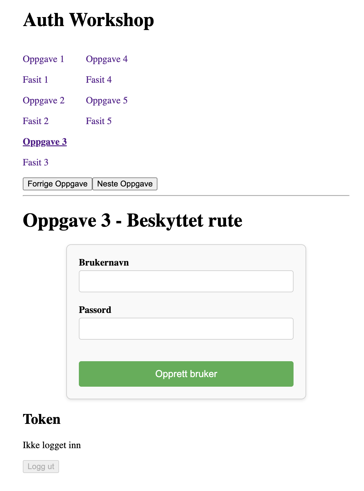

# Feilhåndterings- Workshop



Workshop for å lære feilhåndtering i React. Du finner oppgavene i `src/oppgaver`.

## Hvordan utføre workshopen

Du leser oppgave1 i `Oppgave01.tsx`, og ser fasit i `Fasit01.tsx`, og så videre.

👉 Oppgaven

- Kodeoppgave du må gjøre

💡 Refleksjonsspørsmål.

- Reflekter rundt oppgaven og eventuelt løsningsforslag. Selv om du ikke må løse noe konkret her, anbefaler jeg deg å vurdere spørsmålene, også oppimot egen løsning i dine prosjekter.

📖 Lesestoff

- Kilde du kan finne svar eller gå dypere for videre lesing. Jeg anbefaler deg å hvert fall skumme over innholdet i lenkene.

✅ Løsning

- Checkmark for å belyse hvor endringen i koden er gjort, gjerne i en fil a la "Fasit01.tsx". Selv om jeg kaller filene for fasit, ta dem som forslag til løsning. Om din løsning er annerledes enn løsningsforslaget, gjerne reflekter over hva som er fordelen eller ulempen med det ene eller andre.

## Setup

Node version (see .nvmrc):

```
nvm use
```

Install

```
npm install
```

## App run

Run client and server: (port 3000 and 8000)

```
npm run dev
```
